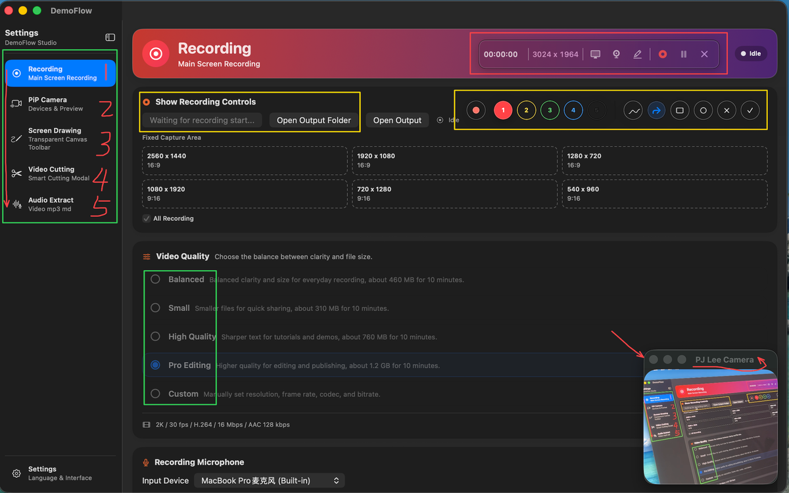
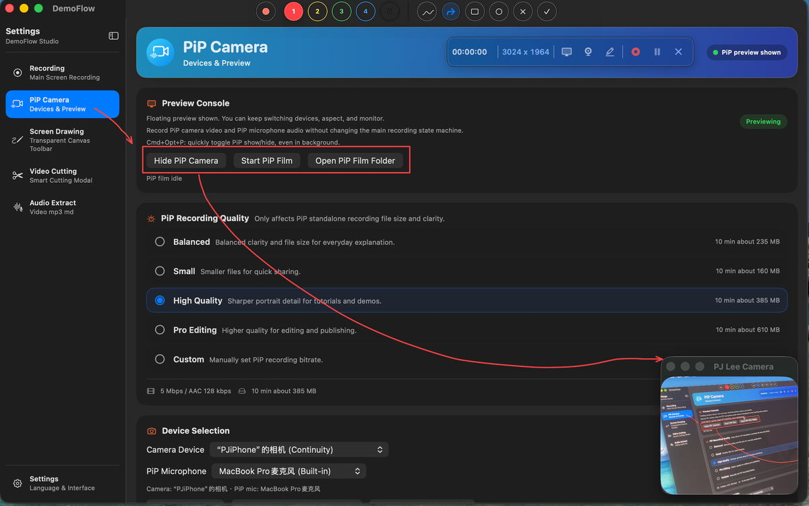
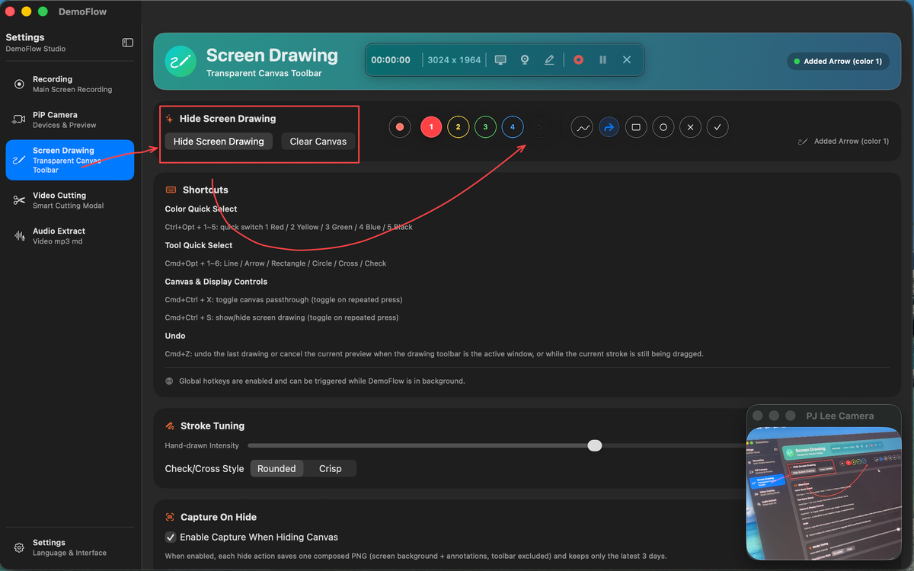
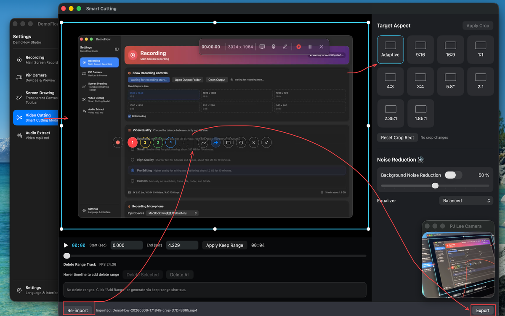

# DemoFlow

<p align="center">
  <a href="README.md">English</a> · <a href="README.zh-CN.md">中文</a>
</p>


[](https://github.com/pjcycle/DemoFlow/actions/workflows/ci.yml)

DemoFlow is a macOS utility suite for screen recording, PiP camera, screen drawing, video cutting, and audio extraction.

## Modules

### Recording



- Full-screen recording on the primary display
- Floating recording controller for stop/pause
- Auto-hide main window during recording

### PiP Camera



- Independent floating camera preview (always-on-top, works across Spaces)
- Video/audio device selection including Continuity Camera
- Preview mute and real-time microphone level feedback
- Aspect ratio: Auto / 16:9 / 4:3
- Global hotkey: `⌘⌥P`

### Screen Drawing



- Floating toolbar + transparent canvas overlay
- 6 tools: line, arrow, rectangle, ellipse, cross, check
- 5 color presets: red / yellow / green / blue / black
- Unified dismissal animation pipeline

Hotkeys:
- `⌃⌥1~5` — color presets
- `⌘⌥1~6` — drawing tools
- `⌘⌃S` — toggle overlay
- `⌘⌃X` — toggle canvas passthrough

### Video Cutting



- Drag-and-drop or file import for `.mp4` / `.mov`
- Timeline trimming, multi-range deletion, crop, audio denoise/EQ, export

### Audio Extract

- Extract MP3 from local files (`.mp4` / `.mov` / `.mkv` / `.webm` / `.mp3`)
- Online URL extraction (full version only)
- Default output: `~/Library/Containers/<bundle-id>/Data/Library/Application Support/DemoFlow/Outputs/AudioExtract/`

## Requirements

- macOS 14.0 or later
- Apple Silicon (arm64) — Intel not supported

## Permissions

DemoFlow requests:

- **Screen Recording** — for screen capture
- **Camera** — for PiP preview and camera recording
- **Microphone** — for recording and PiP audio
- **User-selected files and folders** — for import, export, and manually selected output folders

Generated recordings, PiP films, screen annotation captures, and default audio extracts are saved in the app container under `Application Support/DemoFlow/Outputs/`; DemoFlow does not write to `Movies` or `Pictures` by default.

## Download

Pre-built binaries from the latest CI run:

- [**AppStore** build](https://github.com/pjcycle/DemoFlow/actions/workflows/ci.yml) — without yt-dlp (Mac App Store compatible)
- [**Release** build](https://github.com/pjcycle/DemoFlow/actions/workflows/ci.yml) — with yt-dlp (full features)

Click the links above, open the latest successful run, and download the artifact from the **Artifacts** section at the bottom.

## Build

Open `DemoFlow.xcodeproj` in Xcode 16+, select the `DemoFlow` scheme, and build.

Or from the project root:

```bash
xcodebuild -project DemoFlow.xcodeproj -scheme DemoFlow -destination 'platform=macOS' build
```

## Dual-Channel Builds

| Configuration | yt-dlp | Distribution |
|---------------|--------|--------------|
| **AppStore** (default) | Excluded | Mac App Store |
| **Release** | Included | Direct download |

See [BUILD_CHANNELS.md](BUILD_CHANNELS.md) for details.

## Repo Layout

```
├── DemoFlow.xcodeproj
├── DemoFlow/
│   ├── DemoFlowApp.swift
│   ├── Views/
│   ├── Models/
│   ├── Services/
│   ├── ViewModels/
│   ├── Lang/
│   ├── Extensions/
│   ├── ThirdParty/
│   └── Assets.xcassets/
├── img/
├── Scripts/
├── BUILD_CHANNELS.md
├── README.md
└── README.zh-CN.md
```

## License

MIT. See [LICENSE](LICENSE) for details.